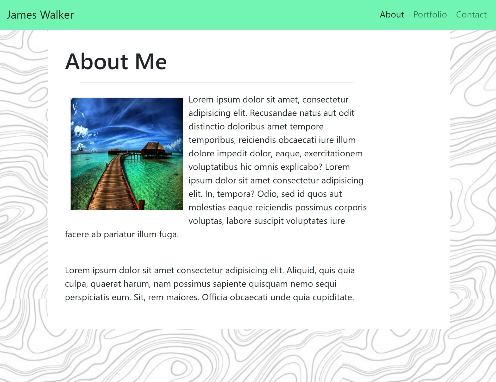
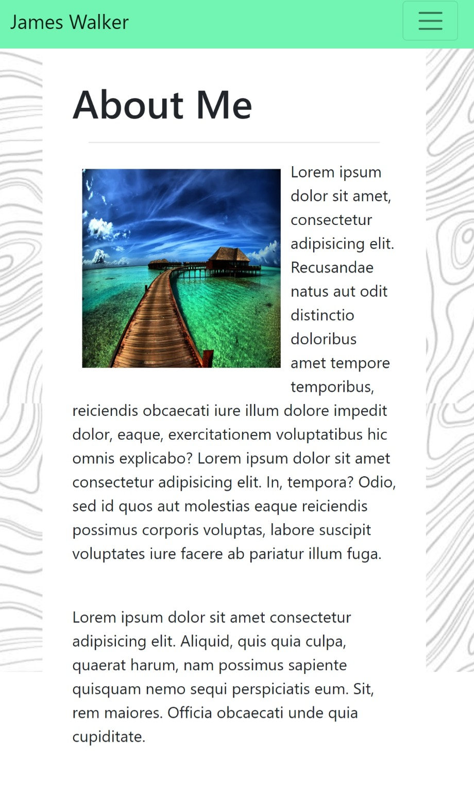
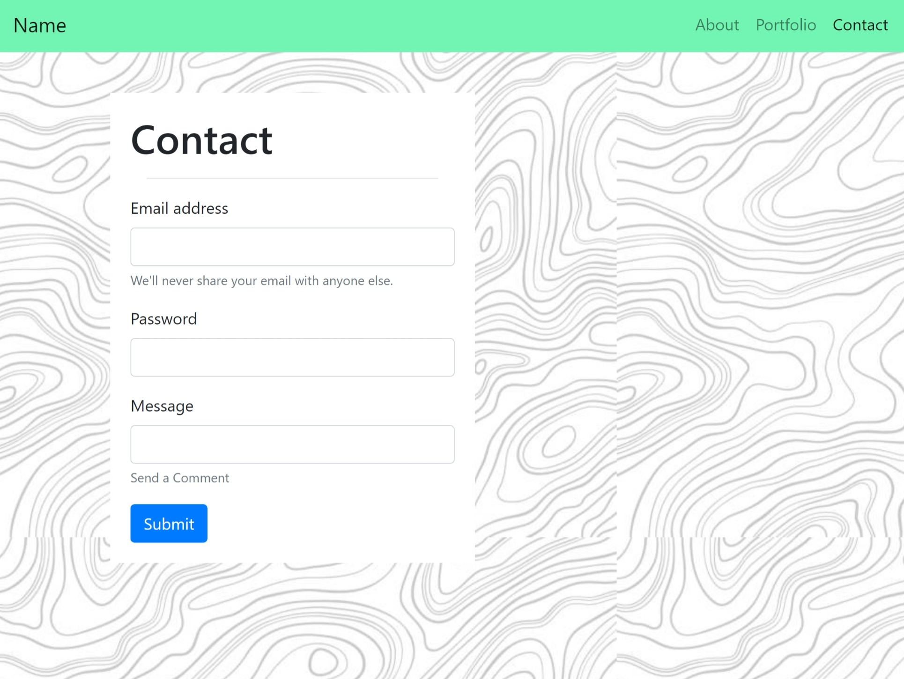
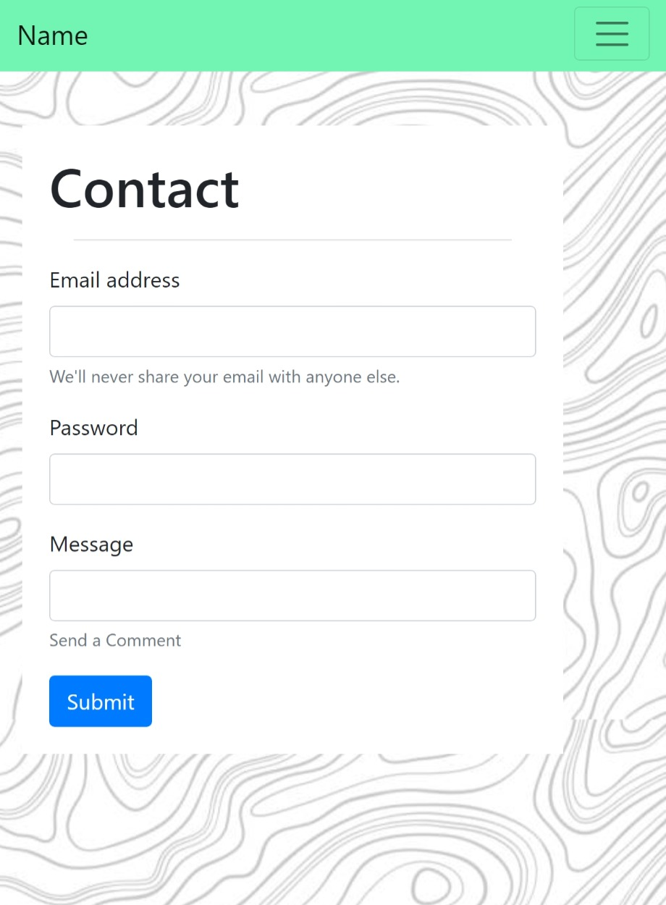
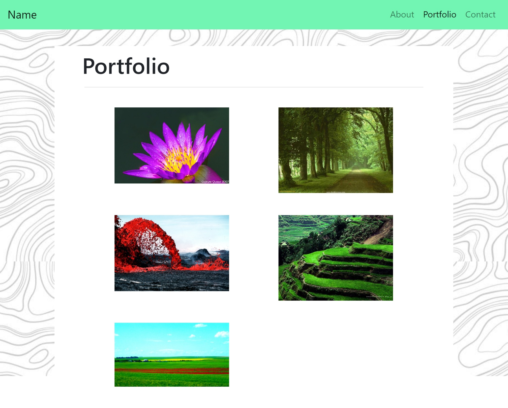
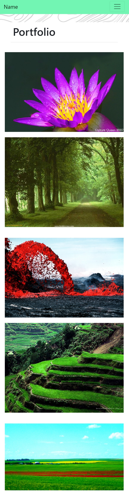

# Responsive Portfolio Project 
The goal for this project was to create a responsive webpage for the display of an image portfolio. the website contains three navigable pages and is responsive to the sizes of the browser.

>### Features
>- Responsive Navbar consistent across pages
>- Contact form with text field
>- Responsive image portfolio
---
### Below are screenshots of the pages.
---

#### About/Index

#### Contact Page

#### Portfolio page

---

Thanks in advance for your feedback!